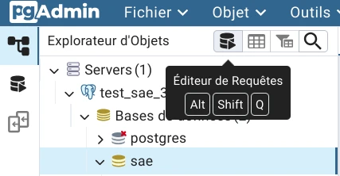

# Projet R4.C.10

## Serveur local de test avec `docker compose`

Si vous avez une ancienne version de Docker (inférieur à `20.10.13`),
utilisez `docker-compose` avec un tiret au lieu de `docker compose` sans tiret.

### Mise en place

 1. Assurez-vous d'être sur une branche à jour avec `main`.

 2. Copiez le fichier `docker/.env.example` dans `docker/.env`
    (`cp docker/.env.example docker/.env` depuis la racine du projet).
    Modifiez les valeurs de `docker/.env` si nécessaire.<br>
    `docker/.env.example` est un fichier exemple accessible par tous le monde,
    donc ne le modifiez pas et n'y mettez aucunes informations sensibles.

 3. Créez le fichier `html/php/connect_params.php` avec les information de
    `docker/.env` sous la forme suivante&nbsp;:

    ```php
    <?php
    trait ConnectionParam {
        private string $server = 'postgresdb';      // Nom du conteneur PostgreSQL dans `docker/docker-compose.yml`
        private string $driver = 'pgsql';
        private string $dbname = 'test';            // Valeur de `DB_NAME` dans `docker/.env`.
        private string $user   = 'test';            // Valeur de `DB_USER` dans `docker/.env`.
        private string $pass   = 'test_password';   // Valeur de `DB_ROOT_PASSWORD` dans `docker/.env`.
    }
    ```

 4. Lancer le serveur une première fois&nbsp;: dans un terminal, placez-vous dans le dossier `docker/`,
    puis exécutez&nbsp;:
      - Linux (bash)&nbsp;: `docker compose up --build && docker compose logs -f`.
      - Windows (Powershell en mode administrateur)&nbsp;: `docker compose up --build; if ($?) { docker compose logs -f }`

 5. Ouvrez pgAdmin à l'adresse `http://localhost:${PGADMIN_PORT}/`.
    Remplacez `${PGADMIN_PORT}` par la valeur de `PGADMIN_PORT` dans `docker/.env` (par défaut `8081`).
      - Identifiant&nbsp;: `${PGADMIN_EMAIL}@dbadmin-sae.com`
        Remplacez `${PGADMIN_EMAIL}` par la valeur de `PGADMIN_EMAIL` dans `docker/.env`.
      - Mot de passe&nbsp;:  Valeur de `PGADMIN_PASSWORD` dans `docker/.env`.

 6. Ajoutez un serveur avec les information suivantes&nbsp;:

      - Onglet `Général`
          - Nom&nbsp;: Choisissez un nom, par exemple `r4c10`.

      - Onglet `Connexion`
          - Nom d'hôte / Adresse&nbsp;: `postgresdb` (Nom du conteneur PostgreSQL dans `docker/docker-compose.yml`)
          - Port&nbsp;: `5432`
          - Base de données de maintenance&nbsp;: Valeur de `DB_NAME` dans `docker/.env`.
          - Identifiant&nbsp;: Valeur de `DB_USER` dans `docker/.env`.
          - Authentification Kerberos&nbsp;?&nbsp;: Désactivé
          - Mot de passe&nbsp;: Valeur de `DB_ROOT_PASSWORD` dans `docker/.env`.

        Laissez les valeurs par défaut pour le reste.

 7. Ouvrez l'éditeur de requêtes (`Alt` + `Shift` + `Q`)

    

 8. Copier le contenu de `sql/createdb.sql` dans l'éditeur de requêtes puis exécutez le script (`F5`).

    

Après avoir effectuer ces étapes, le serveur local devrait être prêt.

### Lancement du serveur

Pour lancer le serveur, ouvrez un terminal dans `docker/` et exécutez&nbsp;:

- Linux (bash)&nbsp;: `docker compose up && docker compose logs -f`.
- Windows (Powershell)&nbsp;: `docker compose up; if ($?) { docker compose logs -f }`

### Accéder au site

Le site sera accessible à l’adresse `http://localhost:${PORT_WEB}/`.<br>
Remplacez `${PORT_WEB}` par la valeur de `PORT_WEB` dans `docker/.env` (par défaut `8080`).

### Arrêter le serveur

Pour arrêter le serveur sans supprimer les données du conteneur,
ouvrez un terminal dans `docker/` et  exécutez `docker compose down`.<br>
Pour arrêter le serveur et supprimer les données du conteneur,
ouvrez un terminal dans `docker/` et  exécutez `docker compose down -v`.
