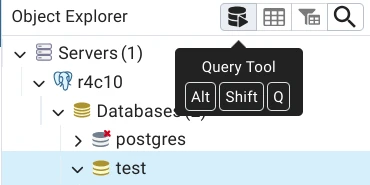
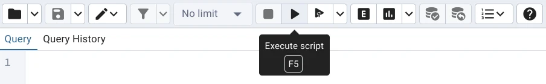

# R4.C.10 - Analysis and advanced data visualization

## Setup the app

If you have an old version of Docker (less than `20.10.13`),
use `docker-compose` with a dash instead of `docker compose` without a dash.

### Installation

 1. Clone the project.

 2. Copy the `docker/.env.example` file to `docker/.env`
    (`cp docker/.env.example docker/.env` from the project root).
    Change the values in `docker/.env` if necessary. 
    `docker/.env.example` is an example file accessible to everyone,
    so don't modify it or put any sensitive information in it.

 3. Do the same with `www/config/connect-param.php.example`.
    Make sure the values are the same in both files.

 4. Start the server the first time: in a terminal, go to the `docker/` folder, then run:
      - Linux (bash): `docker compose up --build && docker compose logs -f`.
      - Windows (Powershell as administrator): `docker compose up --build; if ($?) { docker compose logs -f }`

 5. Open pgAdmin at `http://localhost:${PGADMIN_PORT}/`.
    Replace `${PGADMIN_PORT}` with the value of `PGADMIN_PORT` in `docker/.env` (default `8081`).
      - Email Address / Username: `${PGADMIN_EMAIL}@dbadmin-sae.com`
        Replace `${PGADMIN_EMAIL}` with the value of `PGADMIN_EMAIL` in `docker/.env`.
      - Password: Value of `PGADMIN_PASSWORD` in `docker/.env`.

 6. Add a new server:

      - `General` Tab
          - Name: Choose a name, e.g. `r4c10`.

      - `Connection` Tab
          - Host name/address: `postgresdb` (Name of the PostgreSQL service in `docker/docker-compose.yml`)
          - Port&nbsp;: `5432`
          - Maintenance database: `DB_NAME` value in `docker/.env`.
          - Username: `DB_USER` value in `docker/.env`.
          - Kerberos authentication?: `off`
          - Password: `DB_ROOT_PASSWORD` value in `docker/.env`.

        Leave the rest to default values.

 7. Select the database and open the query tool (`Alt` + `Shift` + `Q`)

    

 8. Copy the contents of the `sql/createdb.sql` file into the query tool, then run the script (`F5`).

    

### Starting the server

To start the server, open a terminal in `docker/` and run:

- Linux (bash): `docker compose up && docker compose logs -f`.
- Windows (Powershell): `docker compose up; if ($?) { docker compose logs -f }`

### Access the app

The app will be accessible at `http://localhost:${PORT_WEB}/`. 
Remplace `${PORT_WEB}` with the value of `PORT_WEB` in `docker/.env` (default `8080`).

### Stop the serveur

To stop the server without deleting the container data,
open a terminal in `docker/` and run `docker compose down`. 
To stop the server and delete the container data,
open a terminal in `docker/` and run `docker compose down -v`.
